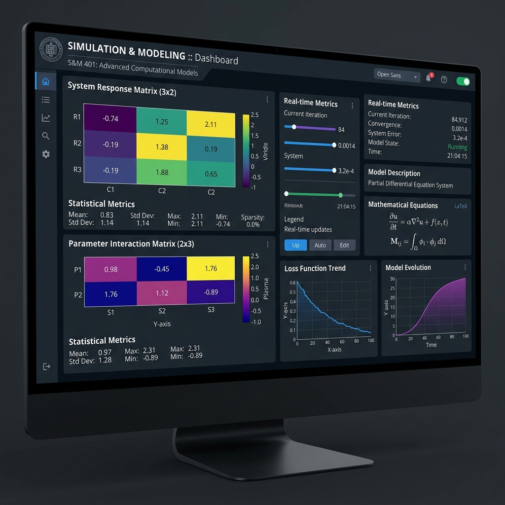

# Simulation and Modeling Lab (CSE 413)



## 📌 Course Metadata
- **Course Code:** CSE 413
- **Course Title:** Simulation and Modeling Lab
- **Level/Term:** 4/1
- **Credit:** 1.5
- **Instructor:** Afroja Ahmed Smrity
- **Department:** Computer Science and Engineering (CSE)

---

## 🎯 About This Repository
This repository contains the practical lab submissions, performance evaluations, mathematical simulations, and Jupyter Notebooks for the **CSE 413: Simulation and Modeling Lab** course.

The course covers computer-based modeling and numerical simulation techniques using Python (`NumPy`, `SciPy`, `Matplotlib`, `Seaborn`, and `SymPy`), including matrix operations, random number generation, hypothesis testing, Kolmogorov-Smirnov tests, Monte Carlo simulations, and queuing models.

---

## 📁 Repository Directory Structure

```
simulation-lab/
│
├── preview.png                        # Repository banner / dashboard preview
├── README.md                          # Main repository overview & documentation
├── FOLDERS.md                         # Detailed class directory index & module log
├── .gitignore                         # Build and environment exclusions
│
├── lab1/                              # Lab Day 1 Materials & Submissions
│   ├── README.md                      # Lab 1 overview & documentation
│   ├── SIM_Lab_Day 1.ipynb            # Class reference notebook
│   └── SIM_Lab1_Azhar_1120.ipynb      # Completed Day 1 notebook submission
│
├── lab2/                              # Lab Day 2 Materials & Submissions
│   ├── README.md                      # Lab 2 overview & documentation
│   ├── Class Performance 1.pdf        # Class Performance 1 task specification
│   └── SIM_CP1_Azhar_1120.ipynb       # Class Performance 1 submission notebook
│
├── lab3/                              # Lab Day 3 Materials & Submissions
│   ├── readme.md                      # Lab 3 overview & documentation
│   ├── CP2 7B2.pdf                    # Class Performance 2 task specification
│   ├── Student_Copy_SIM_Lab_Day_2(matrix_op_graph_plot_subplot).ipynb # Template notebook
│   └── Student_CP2_Azhar_1120.ipynb   # Class Performance 2 submission notebook
│
├── lab4/                              # Lab Day 4 Materials & Submissions
│   ├── readme.md                      # Lab 4 overview & revision notes
│   ├── SIMLAB_Day_3.ipynb            # Class reference notebook
│   ├── SIM_Lab4_Azhar_1120.ipynb      # Completed Day 4 notebook submission
│   ├── Lab4_Distributions_and_Random_Variates.docx # Word document notes
│   └── Lab4_Distributions_and_Random_Variates.pdf  # Printable PDF notes
│
├── Lab-performances/                  # Lab Performance Evaluations
│   ├── Lab-performance-01/            # Lab Performance 01 Module
│   │   ├── SIM_Lab1_Azhar_1120.ipynb  # Executed lab assignment notebook
│   │   └── readme.md                  # Lab 1 revision notes & mathematical concepts
│   └── Lab-performance-02/            # Lab Performance 02 Module
│       ├── Task-Day-2.pdf             # Task-Day-2 specification PDF
│       ├── SIM_Lab2_Azhar_1120.ipynb  # Unique Matrix Value Investigation notebook
│       └── readme.md                  # Lab 2 revision notes & mathematical concepts
│
├── Course-docs/                       # Official syllabus & course outline
│   └── CSE 413 Simulation_and_Modeling_Lab_Course_Outline_7A_updated_COs.pdf
│
└── notes/                             # Structured lecture & study revision notes
    ├── Lab1_Numpy_Basics.md           # Revision notes for Lab 1
    ├── Lab2_Matrix_Properties.md      # Revision notes for Lab 2
    ├── Lab3_Visualization_Operations.md # Revision notes for Lab 3
    └── Lab4_Distributions_and_Random_Variates.md # Revision notes for Lab 4
```

---

## 📚 Completed Lab Modules

| Module / Lab Day | Directory Path | Key Topics & Operations | Status |
| :--- | :--- | :--- | :---: |
| **Lab Day 01** | [`lab1/`](lab1/) | Scalar-array broadcasting, 3×2 & 2×3 matrix operations, domain clipping (`np.clip`), descending sorting, summary statistics, Seaborn heatmaps. ([Revision Notes](Lab-performances/Lab-performance-01/readme.md)) | ✅ Completed |
| **Lab Day 02** | [`lab2/`](lab2/) | Advanced scalar/array math, 4×3 matrix functions, determinant, rank, eigenvalues, row/column statistics (`SIM_CP1_Azhar_1120.ipynb`). ([Revision Notes](lab2/README.md)) | ✅ Completed |
| **Lab Day 03** | [`lab3/`](lab3/) | 15-element vector comparison plots, 4×4 matrix operations (addition, subtraction, multiplication), subplots & element bar charts (`Student_CP2_Azhar_1120.ipynb`). ([Revision Notes](lab3/readme.md)) | ✅ Completed |
| **Lab Performance 01** | [`Lab-performances/Lab-performance-01/`](Lab-performances/Lab-performance-01/) | Performance evaluation task corresponding to Lab Day 1 concepts. | ✅ Completed |
| **Lab Performance 02** | [`Lab-performances/Lab-performance-02/`](Lab-performances/Lab-performance-02/) | Unique Matrix Value Investigation (Determinant, Rank, Eigenvalues, Inversion, Perturbations). | ✅ Completed |
| **Lab Day 04** | [`lab4/`](lab4/) | Uniform & Normal Distribution, Frequency vs. Density Histograms, Random Permutations, and Seed Control (`SIM_Lab4_Azhar_1120.ipynb`). ([Revision Notes](lab4/readme.md)) | ✅ Completed |

---

## 💻 Tech Stack & Libraries
- **Language:** Python 3.11+
- **Numerical Computing:** NumPy, SymPy
- **Data Visualization:** Matplotlib, Seaborn
- **Environment:** Jupyter Notebooks (`.ipynb`)

---

## 🚀 How to Run the Notebooks Locally

1. **Clone the repository**:
   ```bash
   git clone https://github.com/4xrhd/Simulation-Lab.git
   cd Simulation-Lab
   ```

2. **Set up virtual environment (optional but recommended)**:
   ```bash
   python3 -m venv .venv
   source .venv/bin/activate
   ```

3. **Install required dependencies**:
   ```bash
   pip install numpy matplotlib seaborn sympy notebook
   ```

4. **Launch Jupyter Notebook**:
   ```bash
   jupyter notebook
   ```
